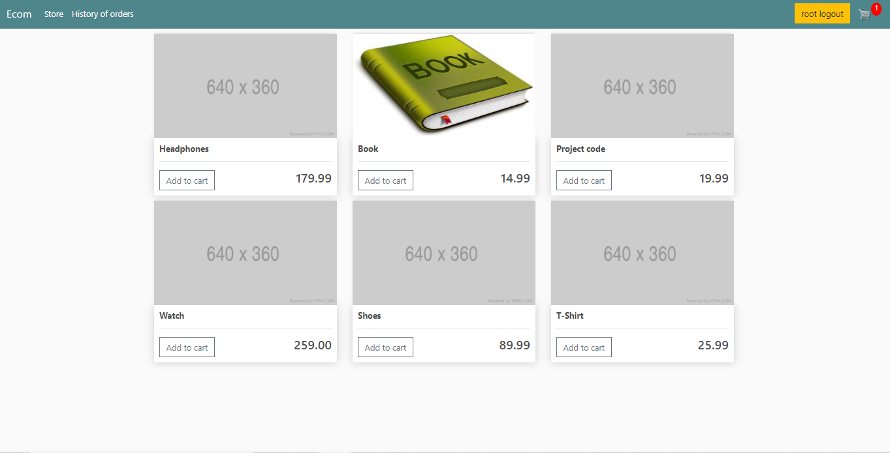

What is it all about: 
this is the e-commerce site where user can buy items (both that require shipping and not).
Moreover user may do shopping without any registration (sessions key used). 

Used technologies:
1. Bootstrap.
2. jQuery ajax.
3. Signals.
4. Selenium (a little).
5. PostgreSQL integration: Amazon web services (AWS). 
6. AWS S3 integration for static files. 
7. Stripe as payment system.
8. Whitenoise + gunicorn.
9. Heroku config.

Coming improvements:

1. Dockerfile.
2. More tests.
3. Admin panel improvements (customization).
4. Heroku config.

How to run: 

Firstly configure your SMPT credentials (gmail config) in .env file in ecommerce folder. 
Required variables:
- EMAIL_HOST_USER=your_email
- EMAIL_HOST_PASSWORD=your_password

In case you are going to use Amazon services: 
- AWS_USER=your_data
- AWS_PASSWORD=your_data
- AWS_PORT=your_data
- AWS_HOST=your_data
- AWS_ACCESS_KEY_ID=your_data
- AWS_SECRET_ACCESS_KEY=your_data

Stripe secret_key:
- STRIPE_SECRET_KEY=your_key
2) Run in command line: 

    git clone https://github.com/artemchege/django-ecommerce

3) Then run: 

    python manage.py runserver 
    
4) Or in Docker: 

    later
    
